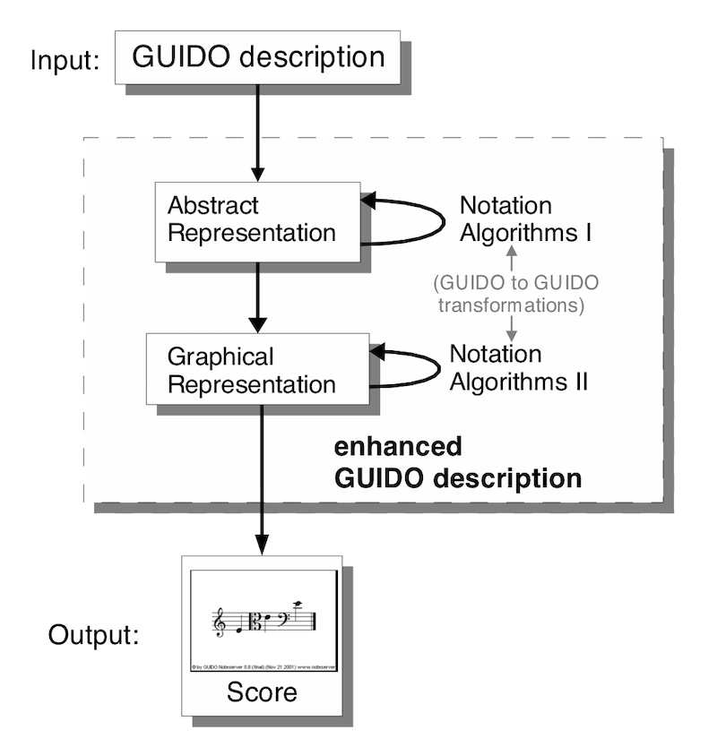

# The Guido Engine Architecture

The Guido Engine may be viewed as black box that takes a textual description of the music at [Guido Music Notation](https://guidodoc.grame.fr/) format to produce various graphic representations as output. 
To do so, the engine proceeds globally in 4 steps (see also the figure below):

- 1) it builds a memory representation of the textual description, which we'll refer later as the [_Abstract Representation_](/internals/arclasses/) [AR]
- 2) it applies a set of transformations to the _Abstract Representation_, which are actually AR to AR transformations and that represents a logical layout transformation: part of the layout (such as beaming for example) may be computed from the AR as well as expressed in AR.
- 3) it transforms to the _Abstract Representation_ into a [_Graphic Representation_](/internals/grclasses/) [GR]: the abstract objects are instanciated in the graphic space with concrete positions and dimensions.
- 4) the _Graphic Representation_ is drawn using the [_Virtual Graphic Device_](/internals/vgdevice/) layer.

